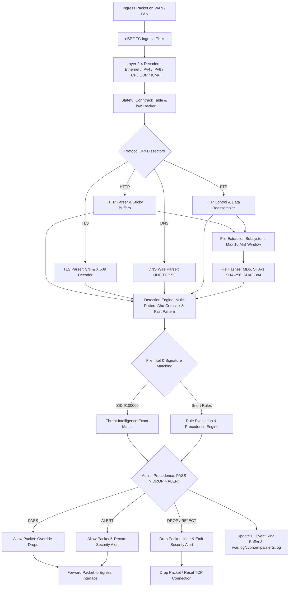

# CyphornIPS 
# High-Performance Inline Network Intrusion Prevention System

[](https://en.wikipedia.org/wiki/C17_(C_standard_revision))
[](https://kernel.org)
[](https://ebpf.io/)
[]()
[]()


**CyphornIPS** is a transparent, inline Intrusion Prevention System (IPS) and Network Security Monitoring engine designed for modern Linux gateways and edge firewalls. Written in standard C17 with native eBPF/TC kernel-bypass acceleration, CyphornIPS bridges dedicated network interfaces to deliver high-throughput deep packet inspection (DPI), stateful TCP stream reassembly, in-memory file extraction, cryptographic exact-hash threat intelligence matching, and atomic zero-downtime hot reload.

> 📖 **Looking for the complete technical reference?**  
[**CyphornIPS Full Technical Documentation**](https://cyphornips.github.io/cyphorn-engine/cyphornips-documentation.html)
---


## 📦 Download CyphornIPS

The latest prebuilt release is available from the official GitHub Releases page.

👉 **[⬇️ Download CyphornIPS](https://github.com/CyphornIPS/cyphorn-engine/releases)**


## 📥 Install from Linux Terminal

Download and install CyphornIPS v1.1.0 directly from GitHub:

```bash
curl -LO https://github.com/CyphornIPS/cyphorn-engine/releases/download/v1.1.0/cyphornips_1.1.0_amd64.deb
sudo apt install ./cyphornips_1.1.0_amd64.deb
```


For Debian / Ubuntu on x86_64 (amd64), download:

**`cyphornips_1.1.0_amd64.deb`**

After downloading, verify the package integrity using the provided
`SHA256SUMS` file, then follow the installation instructions included
in the release notes.

## 📦 Download CyphornIPS

Download the latest prebuilt Debian package:

👉 [⬇️ Download CyphornIPS v1.1.0 (.deb)](https://github.com/CyphornIPS/cyphorn-engine/releases/download/v1.1.0/cyphornips_1.1.0_amd64.deb)


---
## 📊 Runtime Dashboard

CyphornIPS includes an interactive Ncurses runtime dashboard.

To launch the dashboard manually:

```bash
sudo cyphorn-engine
```

## CyphornIPS reads the configured WAN and LAN interfaces from:
```bash
/etc/cyphornips/cyphornips.conf
```

## Example:
```bash
CyphornIPS: Interface configuration: WAN=enp0s3 LAN=enp0s9
CyphornIPS: loaded 3203 rules
```
---

**Supported platform:**

- 🐧 Debian / Ubuntu
- 💻 x86_64 / amd64

For installation instructions, see the
[CyphornIPS v1.1.0 Release](https://github.com/CyphornIPS/cyphorn-engine/releases/tag/v1.1.0).

**The release includes:**

- 📦 Prebuilt Debian package
- 🔐 SHA-256 checksum
- 📥 Installation instructions
- 🗑️ Uninstallation instructions
- 🔄 Update instructions


---

## Table of Contents

1. [Overview & Highlights](#overview--highlights)
2. [Key Features](#key-features)
3. [Architecture & Data Pipeline](#architecture--data-pipeline)
4. [Detection & Enforcement (Action Precedence)](#detection--enforcement-action-precedence)
5. [Rule Engine & Canonical Fingerprinting](#rule-engine--canonical-fingerprinting)
6. [File Intelligence Threat Engine](#file-intelligence-threat-engine)
7. [Update Engine & Atomic Pipeline](#update-engine--atomic-pipeline)
8. [Installation & Prerequisites](#installation--prerequisites)
9. [Configuration](#configuration)
10. [Usage & Deployment](#usage--deployment)
11. [Administrative CLI (`cyphornctl`)](#administrative-cli-cyphornctl)
12. [Testing & Verification](#testing--verification)
13. [Security Considerations & Operational Safety](#security-considerations--operational-safety)
14. [Disclaimer & Operational Notice (إخلاء المسؤولية)](#disclaimer--operational-notice-إخلاء-المسؤولية)
15. [Documentation Suite & References](#documentation-suite--references)

---

## Overview & Highlights

CyphornIPS operates as a transparent Layer 2/3 inline bridge placed between a WAN (untrusted) interface and a LAN (protected) interface. Ingress frames are captured via high-speed kernel interfaces (eBPF TC filters / AF_PACKET), parsed across network and application protocols, matched against Snort/Suricata-compatible signature rules and cryptographic threat intelligence datasets, and either forwarded with zero copy or dropped inline before entering the local network.

```
                  ┌────────────────────────────────────────────────────────┐
                  │                      CyphornIPS                        │
                  │   Transparent Inline Intrusion Prevention Engine      │
 WAN Interface    │                                                        │   LAN Interface
(e.g., enp0s3)   ├───► [eBPF / TC] ──► [Decoders] ──► [Stream Pool] ────┼───► (e.g., enp0s8)
 [Untrusted WAN] │           │             │               │              │   [Protected LAN]
                  │           ▼             ▼               ▼              │
                  │     [Stateful CT]  [DPI Sticky]   [File Extractor]     │
                  │           │             │               │              │
                  │           └─────────────┼───────────────┘              │
                  │                         ▼                              │
                  │              [Detection & Rule Store]                  │
                  │                         │                              │
                  │       Verdict: PASS / DROP / ALERT / REJECT            │
                  └────────────────────────────────────────────────────────┘
```

---

## Key Features

- **Inline eBPF Packet Filtering:** Transparent bridge packet forwarding and sub-microsecond inline drops between dedicated WAN and LAN network interfaces.
- **Stateful Protocol Dissection:** Full IPv4/IPv6 decoders, bidirectional TCP flow reassembly with out-of-order and duplicate segment handling, UDP, and ICMP correlation.
- **Application-Layer Deep Packet Inspection (DPI):**
  - **HTTP/1.0 & HTTP/1.1:** Sticky normalized buffers (`http.uri`, `http.host`, `http.method`, `http.user_agent`, `http.header`, `http.client_body`, `http.stat_code`, `http.stat_msg`).
  - **TLS Handshake Dissection:** SNI extraction (`tls.sni`), X.509 certificate decoding (Subject CN, Issuer, Serial, SHA-1 Fingerprint, Validity expiration check via `tls_cert_expired` / `tls_cert_valid`).
  - **DNS Wire Inspection:** Wire-format parser for UDP and TCP DNS queries (`dns.query`) with pointer loop protection and case normalization.
  - **FTP Data Stream Tracking:** Dynamic connection tracking and protocol inspection for active and passive FTP data transfers (`ftp-data`).
- **File Extraction & Inspection Subsystem:**
  - Bounded in-memory stream reassembly for HTTP Request/Response bodies and FTP data transfers (bounded up to 16 MiB per file).
  - On-the-fly cryptographic hash computation: **MD5**, **SHA-1**, **SHA-256**, **SHA3-384**.
  - MIME type and magic header identification (`filemagic`), lowercased extension derivation (`fileext`), and filename tracking (`filename`).
  - Raw binary payload inspection via `file.data` with `content`, `nocase`, `depth`, `offset`, `distance`, `within`, and `byte_test`.
  - Artifact archival via `filestore;` and `noalert;` saving extracted binaries with structured JSON sidecars to `/var/log/cyphornips/files/`.
- **Exact-Hash Threat Intelligence Engine:**
  - Ingestion of local normalized JSON threat datasets (`/etc/cyphornips/rules/cyphorn-file-intelligence.json`).
  - $O(1)$ exact cryptographic hash matching emitting enriched alerts under dedicated **SID 9100000**.
- **Rule Ownership & SHA-256 Canonical Fingerprinting:**
  - Architectural separation between upstream managed rules (`/etc/cyphornips/rules/managed/`) and custom user signatures (`/etc/cyphornips/rules/local/`).
  - 64-character SHA-256 Canonical Fingerprints resolve SID collisions and prevent accidental deletion of user rules during upstream updates.
- **13-Stage Atomic Update Pipeline & Automated Rollback:**
  - Decoupled Provider Abstraction supporting GitHub CDN (`CyphornIPS/cyphorn-rules`) and Generic HTTP/S3/R2 endpoints (`--manifest-url`).
  - Cryptographic SHA-256 integrity check, combined sandboxed pre-validation, atomic installation, and automated rollback upon reload failure.
- **Zero-Downtime Hot Reload:**
  - Live atomic pointer swapping for rules and threat datasets without packet loss, interface reset, or service interruption.
- **Administrative CLI (`cyphornctl`):**
  - Robust command-line utility communicating over local Unix domain socket (`/run/cyphornips/control.sock`).
- **Interactive Ncurses Dashboard:**
  - 4-screen live operational dashboard (System Overview, Packet Flow, Connection Table, Rule Inspector) with real-time status badges.

---

## Architecture & Data Pipeline



---

## Detection & Enforcement (Action Precedence)

When a transit packet matches multiple rules simultaneously, CyphornIPS enforces a deterministic, security-first Action Precedence Hierarchy:

$$\mathbf{PASS} \quad > \quad \mathbf{DROP} \quad > \quad \mathbf{ALERT}$$

```
   ┌─────────────────────────────────────────────────────────────┐
   │                   Action Evaluation Matrix                  │
   ├──────────────────┬──────────────────────────────────────────┤
   │ 1. PASS          │ Highest priority. Unconditionally        │
   │                  │ permits traffic. Overrides DROP & ALERT. │
   ├──────────────────┼──────────────────────────────────────────┤
   │ 2. DROP / REJECT │ Evaluated if no PASS rule matched.       │
   │                  │ Inline packet is dropped immediately.    │
   ├──────────────────┼──────────────────────────────────────────┤
   │ 3. ALERT         │ Lowest priority. Packet is allowed and   │
   │                  │ logged to alerts.log.                    │
   └──────────────────┴──────────────────────────────────────────┘
```

### Telemetry Status Badges

The interactive UI and JSON telemetry track evaluation states for every loaded rule:

| Badge | Meaning | Packet Verdict | Internal Accounting |
|---|---|:---:|---|
| `[IDLE]` | Rule is active in memory but has not matched any packet yet. | Neutral | `matched == 0`, `effective == 0` |
| `[MATCHED]` | Rule pattern matched incoming traffic at least once. | Contextual | `matched_packets > 0` |
| `[EFFECTIVE]` | Rule determined the final packet verdict. | Definitive | `effective_matches > 0` |
| `[OVERRIDDEN]` (`OVRD`) | Rule matched, but was superseded by a higher-priority action (e.g. `PASS` whitelisting). | Allowed | `matched > 0`, `effective == 0` |
| `[DROPPED]` | Inline blocking rule actively dropped packets. | **BLOCKED** | Increments `dropped_packets` |
| `[ALERTED]` | Detection rule generated security alerts. | Allowed | Increments `alert_count` |

---

## Rule Engine & Canonical Fingerprinting

### Hierarchical Rule Directory Layout

To eliminate the risk of upstream rule updates overwriting custom local signatures, CyphornIPS organizes rules into dedicated directories:

```
/etc/cyphornips/rules/
├── managed/
│   └── rules.rules          # Upstream distribution rules (managed exclusively by cyphornctl update)
└── local/
    ├── custom.rules         # User-defined signature rules
    ├── whitelists.rules     # Administrative PASS overrides
    └── *.rules              # Any additional organization-specific rules
```

### SHA-256 Canonical Rule Fingerprinting

Rule identity is determined by a normalized 64-character SHA-256 fingerprint computed across all canonical rule fields:
- Protocol, Direction, Addresses, and Ports
- Normalized Options, Modifiers, and Values (whitespace-stripped)

```c
/* Upstream Managed Rule */
alert tcp any any -> any 443 (msg:"SSL Probe"; sid:1001; rev:1;)
// Fingerprint: 4a8b1c... (Source: MANAGED)

/* User Local Rule (Same SID, different action & msg) */
pass tcp any any -> 192.168.1.50 443 (msg:"Allow Management SSL"; sid:1001; rev:2;)
// Fingerprint: e7f2a9... (Source: LOCAL)
```
CyphornIPS detects the fingerprint divergence, treats them as independent rules, loads both into memory, and applies standard Action Precedence ($\text{PASS} > \text{ALERT}$).

---

## File Intelligence Threat Engine

- **Exact-Hash Threat Intelligence Engine:**
  Matches extracted file payloads against cryptographic threat-intelligence
  datasets using exact hash lookups.

- **Dataset File:** `/etc/cyphornips/rules/cyphorn-file-intelligence.json`
- **Supported Hash Algorithms:** MD5, SHA-1, SHA-256, SHA3-384
- **Dedicated Alert SID:** **`9100000`**

### JSON Threat Dataset Schema

```json
{
  "schema_version": 1,
  "dataset_version": "2026.08.26.1",
  "generated_at": "2026-08-26T00:00:00Z",
  "records": [
    {
      "sha256": "ba7816bf8f01cfea414140de5dae2223b00361a396177a9cb410ff61f20015ad",
      "sha1": "da39a3ee5e6b4b0d3255bfef95601890afd80709",
      "md5": "d41d8cd98f00b204e9800998ecf8427e",
      "file_name": "malware_payload.exe",
      "file_type": "application/x-dosexec",
      "threat_name": "Win32.Trojan.Agent",
      "severity": "CRITICAL",
      "action": "drop"
    }
  ]
}
```

---

## Update Engine & Atomic Pipeline

CyphornIPS features an enterprise-grade automated update engine designed with a decoupled Provider Abstraction.

### Supported Providers & Channels

- **GitHub Provider (`CYPHORN_PROVIDER_GITHUB`):** Resolves manifests from the official rules repository `CyphornIPS/cyphorn-rules` over GitHub Raw CDN.
- **Generic HTTP Provider (`CYPHORN_PROVIDER_GENERIC_HTTP`):** Fetches manifests directly from internal mirrors, private S3 buckets, or Cloudflare R2 storage via `--manifest-url`.
- **Supported Channel:** `stable` (production-ready, regression-tested rules).

### 13-Stage Atomic Update Pipeline

```
  Provider Check ──► Manifest Fetch ──► Version Gate ──► Staging Download
                                                                │
  Automated Rollback ◄── Engine Reload ◄── Atomic Install ◄── SHA-256 Gate & Sandboxed Validation
```

1. **Manifest Retrieval:** Fetches and parses `manifest.json`.
2. **Version Comparison Gate:** Ensures candidate version is newer (or bypassed via `--force`).
3. **Staging Download:** Downloads payloads into isolated staging directory `/var/lib/cyphornips/updates/staging/`.
4. **SHA-256 Verification Gate:** Computes cryptographic hash of candidate files. Rejects immediately on mismatch.
5. **Combined Sandboxed Pre-Validation:** Staged candidate rules are merged with active local rules in an ephemeral sandbox directory and parsed by the engine loader. If any syntax error exists, the update aborts with zero changes to production files.
6. **Backup Snapshot:** Current `/etc/cyphornips/rules/managed/` is snapshotted to `/var/lib/cyphornips/updates/backup/`.
7. **Atomic Installation:** Replaces candidate files in `managed/` only. `/etc/cyphornips/rules/local/` is never touched.
8. **Ownership Reconciliation:** Re-indexes canonical fingerprints into `/var/lib/cyphornips/rules/ownership.json`.
9. **Zero-Downtime Hot Reload:** Issues reload request over `/run/cyphornips/control.sock`.
10. **Automated Rollback:** If running daemon rejects reload, the backup snapshot is restored and reloaded automatically.

---

## Installation & Prerequisites

### Prerequisites (Ubuntu / Debian)

```bash
sudo apt-get update
sudo apt-get install -y \
  build-essential \
  clang \
  llvm \
  libelf-dev \
  libpcap-dev \
  libssl-dev \
  libncurses-dev \
  libmnl-dev \
  libnetfilter-conntrack-dev \
  pkg-config
```

### Compiling CyphornIPS

```bash
# Clone repository
git clone https://github.com/CyphornIPS/cyphorn-engine.git
cd cyphorn-engine

# Compile engine binary, eBPF TC objects, and cyphornctl CLI
make clean && make -j$(nproc)

# Install binaries to system PATH
sudo cp cyphorn-engine /usr/local/bin/cyphorn-engine
sudo cp bin/cyphornctl /usr/local/bin/cyphornctl

# Create default directories
sudo mkdir -p /etc/cyphornips/rules/managed /etc/cyphornips/rules/local
sudo mkdir -p /var/log/cyphornips /var/lib/cyphornips/updates
```

---

## Configuration

Main engine configuration file: `/etc/cyphornips/cyphornips.conf`

```ini
# ==============================================================================
# CyphornIPS Production Configuration
# ==============================================================================

# Network Interfaces (Required for Inline Bridge)
wan_interface = enp0s3
lan_interface = enp0s8

# Rules and Threat Intelligence
rules_dir                 = /etc/cyphornips/rules
domain_policy_file        = /etc/cyphornips/domain_policy.conf
file_intelligence_enabled = true
file_intelligence_file    = /etc/cyphornips/rules/cyphorn-file-intelligence.json

# File Extraction Subsystem
file_extraction_enabled   = true
file_storage_dir          = /var/log/cyphornips/files
file_max_size_bytes       = 16777216

# Logging and Telemetry
log_dir                   = /var/log/cyphornips
log_file                  = /var/log/cyphornips/cyphornips.log
log_level                 = INFO
log_max_size_mb           = 50
log_max_files             = 5
```

---

## Usage & Deployment

### 1. Interactive Terminal Dashboard Mode

Launch CyphornIPS directly in your terminal to inspect live packet rates, active connections, and rule detections:

```bash
sudo /usr/local/bin/cyphorn-engine -w enp0s3 -l enp0s8 -r /etc/cyphornips/rules
```

**Dashboard Keyboard Navigation:**
- `Tab` / `1`–`4`: Switch between screens (Overview, Packet Flow, Connection Table, Rule Inspector).
- `Up` / `Down`: Scroll lists and tables.
- `Enter`: View detailed inspector for selected connection or rule.
- `q`: Exit cleanly.

### 2. Background Service Mode (Systemd)

Create `/etc/systemd/system/cyphornips.service`:

```ini
[Unit]
Description=CyphornIPS Inline Network Intrusion Prevention Engine
After=network.target

[Service]
Type=simple
ExecStart=/usr/local/bin/cyphorn-engine -c /etc/cyphornips/cyphornips.conf
Restart=always
RestartSec=3
LimitNOFILE=65535

[Install]
WantedBy=multi-user.target
```

```bash
sudo systemctl daemon-reload
sudo systemctl enable --now cyphornips
sudo systemctl status cyphornips
```

---

## Administrative CLI (`cyphornctl`)

`cyphornctl` communicates with the running daemon via `/run/cyphornips/control.sock` to orchestrate updates, reloads, and telemetry querying.

### Complete Command Reference

| Command | Purpose | Operational Side-Effect |
|---|---|---|
| `cyphornctl status` | Display live engine metrics & generations | None (Read-only) |
| `cyphornctl status json` | Export telemetry in structured JSON | None (Read-only) |
| `cyphornctl ping` | Check Unix control socket IPC health | None (Read-only) |
| `cyphornctl update check` | Query remote provider for available updates | None (Read-only) |
| `cyphornctl update migrate` | Migrate flat rule directory to `managed/` + `local/` | Restructures rule directory safely |
| `cyphornctl update rules` | Download, validate, install & reload detection rules | Updates `managed/rules.rules` |
| `cyphornctl update intelligence` | Download, validate, install & reload File Intelligence | Updates `cyphorn-file-intelligence.json` |
| `cyphornctl update all` | All-or-nothing atomic update of rules & intelligence | Updates both datasets atomically |
| `cyphornctl reload rules` | Hot-reload rules from local disk without restart | Re-compiles rules with zero downtime |
| `cyphornctl reload intelligence` | Hot-reload threat intelligence from local disk | Re-indexes hashes with zero downtime |
| `cyphornctl reload all` | Hot-reload both rules and intelligence | Swaps memory pointers atomically |

### CLI Options Table

```text
Options:
  --channel <name>             Set update channel (currently: stable, default: stable)
  --manifest-url <url>         Use generic HTTP provider pointing directly to manifest URL
  --repo <owner/repo>          Override GitHub provider repository (default: CyphornIPS/cyphorn-rules)
  --branch <branch>            Override GitHub provider branch (default: main)
  --force                      Force re-installation even if already at latest version
  --json                       Format output as JSON
  -s, --socket <path>          Override Unix control socket path
  -h, --help                   Display usage message
  --version                    Display version
```

---

## Testing & Verification

CyphornIPS includes a comprehensive regression test suite comprising **61 automated test suites** covering protocol decoders, sticky buffers, file reassembly, threat intelligence, action precedence, rule ownership, update staging, and automated rollback.

```bash
# Execute the full regression test suite
./tests/run_all_tests.sh
```

```text
==========================================
ALL TESTS PASSED SUCCESSFULLY!
==========================================
=== ALL 61 TEST SUITES COMPILED AND PASSED SUCCESSFULLY! ===
```

---

## Security Considerations & Operational Safety

- **Administrative Privileges:** Raw packet capture and inline network filtering require root privileges or `CAP_NET_ADMIN` / `CAP_NET_RAW`.
- **Configuration Protection:** Restrict write permissions on `/etc/cyphornips/` to root (`chmod 600 cyphornips.conf`).
- **Pre-Production Staging:** Always test new signature rules with the `alert` action before elevating them to `drop` to prevent disruption of legitimate production traffic.

### Golden Rules of CyphornIPS Administration

1. **NEVER manually edit files inside `/etc/cyphornips/rules/managed/`:** Upstream updates manage this directory exclusively. Put custom rules in `/etc/cyphornips/rules/local/`.
2. **NEVER rely on SID alone for rule identity:** CyphornIPS identifies rules by their 64-character Canonical Fingerprint to safely support shared SIDs across upstream and local datasets.
3. **NEVER delete `/etc/cyphornips/rules/local/` when troubleshooting:** Local custom rules and whitelist overrides are preserved permanently during update rollbacks.
4. **NEVER assume `MATCHED` means traffic was dropped:** Check `[EFFECTIVE]` and `[DROPPED]` counters to verify whether a higher-priority `PASS` rule overrode the action.

---

## Disclaimer & Operational Notice (إخلاء المسؤولية)

> [!WARNING]
> **Developer Preview / Alpha Release Advisory:**  
> **CyphornIPS 0.1.0 is currently an experimental Developer Preview / Alpha release.** It is provided for evaluation, security research, lab validation, and community testing. **It is not designed, certified, or intended to serve as a sole, unmonitored security perimeter in mission-critical production environments.**

### Key Disclaimers

- **Nature of the Software:** CyphornIPS is a network security monitoring and intrusion prevention tool. **It is not an absolute or infallible guarantee against cyber attacks, malware, data breaches, or unauthorized intrusions.**
- **No Absolute Detection Warranty:** Efficacy depends on active signature coverage, heuristic accuracy, protocol parser fidelity, network throughput, and software release version.
- **False Positives & False Negatives:** Signatures and heuristics may generate false positives on legitimate business traffic or fail to detect novel, obfuscated, or zero-day attack vectors.
- **Mandatory Policy Staging:** Administrators are solely responsible for testing rules and domain policies in a non-production staging environment prior to deploying inline blocking.
- **Operational Impact of `DROP` / `PASS` Rules:** Misconfigured inline blocking rules may drop legitimate business workflows, while overly broad pass rules may whitelist unauthorized traffic.
- **Defense-in-Depth:** CyphornIPS does **not** replace host hardening, vulnerability management, timely patching, secure backups, strong IAM, Multi-Factor Authentication (MFA), network micro-segmentation, or active incident response procedures.
- **Limitation of Liability:** Provided "AS-IS" without warranties of any kind. To the maximum extent permitted by law, authors and contributors shall not be held liable for any direct, indirect, incidental, or consequential damages, loss of profits, data loss, or service interruptions arising from the use of this software.
- **Regulatory Compliance:** Users are responsible for ensuring that packet inspection, file extraction, logging, and metadata storage comply with all applicable local privacy and telecommunications laws.

### Practical Operational Example

```text
Consider an administrator who creates an overly broad blocking rule:
  drop tcp any any -> any 80 (msg:"Block Web Admin"; http.uri; content:"admin"; sid:9900001; rev:1;)

While syntactically valid, this rule will drop legitimate client requests to:
  - /assets/js/admin-tools.min.js (Legitimate JavaScript asset)
  - /portal/readmission/status (Legitimate user portal)

Best Practice: Always deploy new rules with 'alert' first, observe match rates on Screen 4 (Rule Inspector), and only elevate to 'drop' once verified.
```

For full legal and operational details, see **[Section 22.1: Disclaimer & Operational Notice](cyphornips-documentation.html#disclaimer)** in the documentation.

---

## Documentation Suite & References

- 📖 [**CyphornIPS Full Technical Documentation**](https://cyphornips.github.io/cyphorn-engine/cyphornips-documentation.html)  guide covering all subsystems, decoders, sticky buffers, and operational workflows.
- 📂 **[Modular Documentation Index (`docs/README.md`)](docs/README.md)**:
  - 💻 [CLI Reference (`cyphornctl`) (`docs/cli-reference.md`)](docs/cli-reference.md)
  - 🛡️ [Rule Engine & Fingerprinting (`docs/rules.md`)](docs/rules.md)
  - ⚖️ [Rule Action Precedence (`docs/action-precedence.md`)](docs/action-precedence.md)
  - 📊 [Telemetry & UI Metrics (`docs/telemetry.md`)](docs/telemetry.md)
  - 🔄 [Update Engine & Providers (`docs/updates.md`)](docs/updates.md)
  - 🛠️ [Troubleshooting Guide (`docs/troubleshooting.md`)](docs/troubleshooting.md)
  - 🏗️ [Developer & Systems Architecture (`docs/architecture.md`)](docs/architecture.md)

---


## 🔐 License

CyphornIPS is proprietary software.

The CyphornIPS source code and original materials in this repository
are provided under the [CyphornIPS Proprietary License](LICENSE).

The license permits commercial and non-commercial use, modification,
and integration of CyphornIPS into software, hardware, products,
network appliances, services, and other solutions.

Products and services that include CyphornIPS as a component may be
distributed and sold, subject to the terms and restrictions of the
license.

Redistribution, licensing, or sale of CyphornIPS itself as a standalone
software product is not permitted without separate written
authorization from CyphornIPS.

Third-party components remain subject to their respective licenses.

See [LICENSE](LICENSE) for the complete terms.
