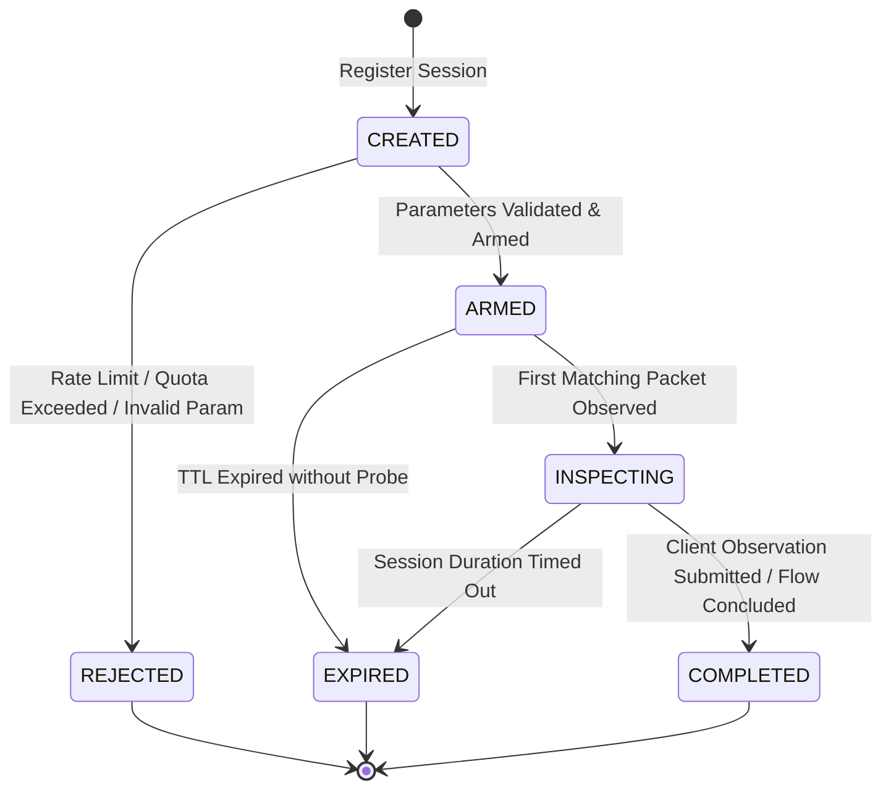

# CyphornIPS Diagnostic Correlation System — Phase 1 Design Specification

## Summary
Phase 1 Design Specification. |=============================>|  [State: ARMED -> INSPECTING]
        |                              |  [Correlate Flow / TCP / ICMP / TLS / HTTP]
        |                              |  [Record Observation & Security Verdicts]
        | 3. Submit Client Result      |
        |----------------------------->|  [State: INSPECTING -> COMPLETED]
        v                              v
```

---

## 2. Integration with Existing CyphornIPS Architecture

> [!IMPORTANT]
> **No Secondary Flow Tracker Rule**: The Diagnostic Correlation Engine does **NOT** duplicate flow tracking, sequence tracking, or packet buffers. It directly references CyphornIPS's existing data structures:
> - `ConnectionTable` & `Connection` (`include/connection.h`)
> - TCP Stream Reassembly & Segment tracking (`include/tcp_stream.h`, `include/tcp_reassembly.h`)
> - `CyphornAlertStore` & `CyphornAlert` (`include/alert.h`)
> - `CyphornEnforcement` (`include/enforcement.h`)
> - Application Metadata (`CyphornTlsMetadata`, `CyphornHttpTransaction` in `include/app_metadata.h`, `include/http.h`)

### Integration Points in the Packet Pipeline

```
Packet Ingest (Capture / Ring Buffer)
                 │
                 ▼
         Ethernet / IP Decoder
                 │
                 ▼
       Connection Table Lookup ◄─────── [Diagnostic Session Hook: Match 5-Tuple / ICMP / DNS]
                 │
                 ▼
    TCP Reassembly / Protocol DPI ◄─── [Diagnostic Session Hook: Track Layers & Observation State]
                 │
                 ▼
    Rule Engine / Fast Pattern Match ◄─ [Diagnostic Session Hook: Capture ALERT / DROP verdicts]
                 │
                 ▼
    Active Enforcement (Drop / RST) ◄── [Diagnostic Session Hook: Record Enforcement Method]
```

---

## 3. Diagnostic Session Lifecycle

A diagnostic session progresses strictly through deterministic states:



### Lifecycle States
1. **`CREATED`**: Session metadata submitted by client.
2. **`ARMED`**: Session accepted, validation passed, and correlation criteria active. **TTL starts ticking only after transition to `ARMED`.**
3. **`INSPECTING`**: The first packet matching the correlation criteria has been seen on the wire. Directional traffic, protocol transitions, and security events are actively recorded.
4. **`COMPLETED`**: Diagnostic probe concluded, client submitted observation, and Cyphorn has finalized the diagnosis.
5. **`EXPIRED`**: Configured TTL elapsed before packet observation or probe completion.
6. **`REJECTED`**: Session rejected during registration (e.g. rate limit, memory quota, invalid 5-tuple).

---

## 4. Deterministic Correlation Matrix

Correlation must be strict and mathematical. If correlation cannot be proven, the system **never guesses**.

| Protocol / Test Type | Primary Correlation Keys | Secondary Identifiers | Fallback / Failure Behavior |
| :--- | :--- | :--- | :--- |
| **TCP (`TCP_SYN`, `TLS`, `HTTP`)** | Exact 5-Tuple: `(SrcIP, SrcPort, DstIP, DstPort, IPPROTO_TCP)` | TCP SYN Sequence Number | If client source port does not match on wire, mark `FLOW_NOT_OBSERVED`. |
| **ICMP (`ICMP_ECHO`)** | `(SrcIP, DstIP, ICMP_TYPE_ECHO_REQ, Ident, Sequence)` | ICMP Identifier & Seq | If NAT or kernel alters ID/Seq, do not guess; reject authoritative match. |
| **DNS Direct (`DNS_DIRECT`)** | 5-Tuple: `(SrcIP, SrcPort, DstIP, 53, IPPROTO_UDP)` | DNS 16-bit Transaction ID (TxID) | Deterministic flow correlation + TxID matching. |
| **DNS System (`DNS_SYSTEM`)** | N/A (Local OS Resolver / Loopback stub) | None | **Always returns `UNKNOWN`. Never claim authoritative correlation.** |

---

## 5. One Session = One Controlled Network Attempt (v1 Rule)

In version 1 of the Diagnostic System:
- **One Session = One Single Controlled Network Probe**.
- **No Happy Eyeballs**: Dual-stack IPv6/IPv4 fallback attempts MUST use two discrete diagnostic sessions with distinct session IDs.
- **No TCP Retransmission Multiplexing**: Retransmitted SYNs for the same probe fall under the same session, but distinct client-side connection attempts require distinct sessions.

---

## 6. Configurable TTL & Idempotent Registration

1. **TTL Mechanics**:
   - TTL starts **only when the session becomes `ARMED`**.
   - Default TTLs:
     - ICMP Ping: 5.0 seconds
     - TCP Handshake: 10.0 seconds
     - TLS Handshake: 15.0 seconds
     - HTTP Request: 20.0 seconds
     - DNS Query: 5.0 seconds
2. **Idempotency**:
   - Clients supply a `client_request_id` (UUID / token).
   - If a client resends a registration with the same `client_request_id` and matching parameters within the TTL window, Cyphorn returns the existing session without creating a duplicate or consuming quota.

---

## 7. Traffic Observation States & Layer Tracking

### Observation States
Traffic visibility is tracked independently across directions:
- **`OBS_NONE`**: No packets observed matching the registered tuple.
- **`OBS_OUTBOUND_ONLY`**: Outbound packets (`Client -> Server`) observed; no reply seen from server.
- **`OBS_INBOUND_ONLY`**: Server responses observed without matching client request (asymmetric routing).
- **`OBS_BIDIRECTIONAL`**: Packets observed in both directions (`Client -> Server` and `Server -> Client`).

### Layers Inspected
- `LAYER_NETWORK` (IP / Routing)
- `LAYER_TRANSPORT` (TCP Handshake / UDP / ICMP)
- `LAYER_TLS` (TLS ClientHello, ServerHello, Certificate, Extensions)
- `LAYER_HTTP` (HTTP Request Line, Headers, Response Status, Body)

---

## 8. Security Events vs. Layer Inspection

> [!IMPORTANT]
> **Clear Separation**:
> - `decision_history` records **only** actionable security verdicts: **`ALERT`** and **`DROP`**.
> - Clean / non-malicious rule evaluations (`NO_MATCH`, `NOT_APPLICABLE`, `ALLOW`) are **NOT** security events.
> - Monitored DPI progress is represented exclusively by `layers_inspected`.

### Recorded Enforcement Methods
When CyphornIPS enforces a DROP, the exact mechanism is explicitly recorded:
- **`ENF_SILENT_DROP`**: Packet discarded at eBPF/XDP/TC or userspace kernel queue without notification.
- **`ENF_RST_INJECTED`**: TCP RST / ICMP Unreachable injected to tear down connection cleanly.
- **`ENF_ALERT_ONLY`**: Traffic permitted to pass; alert logged without dropping.

---

## 9. 